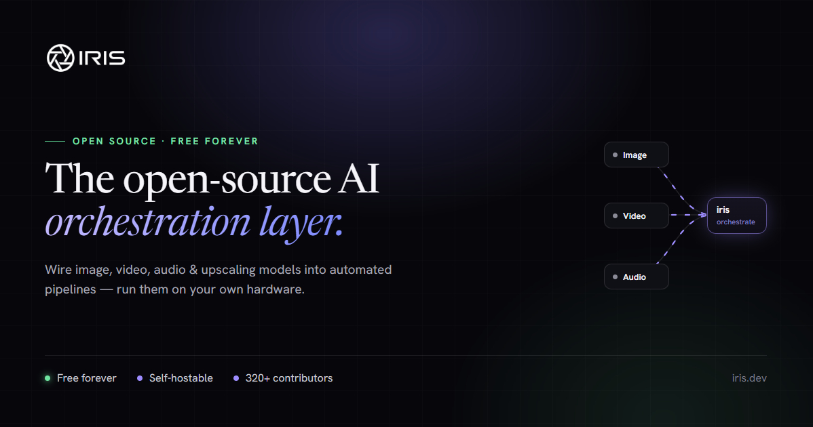

<div align="center">



# Iris

**Fair-code AI automation workflows — run them anywhere, with your own keys.**

Build node-graph AI workflows in your browser, then execute them locally with
your own API keys (BYOK). No server, database, or cloud account required.

</div>

---

Iris is the open, **fair-code** core of the [Parallax AI](https://parallax.kr)
workflow product. The same execution engine that powers the Parallax cloud also
runs **fully on your machine** — `npx iris-flow` launches a local web app, and
the desktop app embeds the engine for offline, BYOK execution.

The **engine, node catalog, and editor are public (fair-code)**; multi-tenant
hosting (managed database, billing, scheduling infrastructure) stays proprietary.

## Packages

| Package | What it is |
|---------|-----------|
| [`iris-nodes`](packages/iris-nodes) | Single source of truth for node definitions (types, config options, ports). |
| [`iris-engine`](packages/iris-engine) | Server-independent execution engine. Runs node graphs against pluggable host ports (storage, secrets, usage, persistence). |
| [`iris-editor`](packages/iris-editor) | The ReactFlow node-graph editor, as a framework-agnostic library consumed via an injected seam. |
| [`iris-host-local`](packages/iris-host-local) | Local host (`npx iris-flow`): JSON-file store, disk storage, BYOK secrets, no-op metering, a Fastify server + bundled editor. |
| [`iris/desktop`](iris/desktop) | Electron desktop app — embeds the engine for local workflow execution, batch, and scheduling via a background daemon. |

## Quick start — local web app (self-host)

Run a local Iris server and build/execute workflows in your browser with your own
AI keys. No server, database, or cloud account required.

```bash
# from a clone of this repo
pnpm install
pnpm build:packages
pnpm iris-flow
```

You'll see:

```
  iris-flow running at http://localhost:4747
  BYOK providers: openai, google, anthropic, xai, ...
  Data dir: /Users/you/.iris-flow/data
```

Open the printed URL — the editor (`/`) and API (`/api/iris/*`) are served on the
same origin, and everything runs on your machine.

Once published to npm you'll be able to skip the clone with `npx iris-flow`.

### Bring your own keys (BYOK)

Provider keys are read from the environment (never written to disk). Copy
[`packages/iris-host-local/.env.example`](packages/iris-host-local/.env.example)
to `.env` in the directory you launch from (or `~/.iris-flow/.env`) and fill in
only what you use:

```dotenv
OPENAI_API_KEY=sk-...
ANTHROPIC_API_KEY=sk-ant-...
GOOGLE_API_KEY=...
```

The startup banner lists which providers it detected. Configure port / host /
data dir via env vars (`PORT`, `IRIS_FLOW_HOST`, `IRIS_FLOW_DATA_DIR`,
`IRIS_FLOW_NO_OPEN`) or a `~/.iris-flow/config.json`.

> ⚠️ The local server has **no authentication** — it's meant for `localhost`.
> Don't bind it to `0.0.0.0` / a public interface without a reverse proxy + auth.

**📖 Full self-hosting guide** — configuration reference, HTTP endpoints, on-disk
data layout, programmatic embedding, limitations, and troubleshooting:
[`packages/iris-host-local/README.md`](packages/iris-host-local/README.md).

## Quick start — desktop app

```bash
pnpm install
pnpm build:packages
pnpm desktop:dev
```

The desktop app stores BYOK keys encrypted in the OS keychain and runs workflows,
batch jobs, and schedules via a local background daemon that survives app close.

## Architecture

```
            ┌─────────────────────────────────────────────┐
            │                 iris-engine                  │
            │  graph traversal · node executor · adapters  │
            │      depends only on EngineHost ports        │
            └───────────────┬─────────────────────────────┘
                            │ implements
        ┌───────────────────┼────────────────────────┐
        ▼                   ▼                         ▼
  Prisma/GCS/token   JSON file / disk / BYOK    Electron main / keychain
  (Parallax cloud,   (iris-host-local, OSS)     (iris/desktop, OSS)
   proprietary)
```

The engine depends only on **host ports**. Each host plugs in its own
implementation of storage, secrets (API keys), usage metering, and persistence —
so the same engine runs in the cloud, in a local web app, or in the desktop app.

## Development

This is a [pnpm workspace](https://pnpm.io/workspaces). Requires Node 20+ and
pnpm 10+ (`corepack enable`).

```bash
pnpm install          # install all workspace members
pnpm build:packages   # build iris-nodes → iris-engine → iris-editor → iris-host-local
pnpm typecheck        # typecheck every package
```

> Node definitions live **only** in `packages/iris-nodes`. After changing them,
> run `pnpm build:nodes` so consumers pick up the new `dist/`.

## License

Source-available under the **Sustainable Use License** (a fair-code license).
Use, modify, and self-host for free for internal, personal,
or non-commercial purposes. You may not sell it or offer it to third parties as a
hosted/managed service. See [LICENSE.md](LICENSE.md).

For a commercial license, contact Parallax AI LLC.
